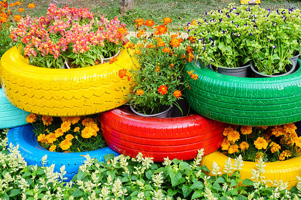

# 🎯 SOLUCIÓN DEFINITIVA - Imágenes Actualizadas

## ✅ CAMBIOS FINALES APLICADOS

### 🔄 Estrategia Utilizada: Nombres de Archivo Completamente Nuevos

El problema era el **caché del navegador** que seguía mostrando las imágenes antiguas.

**Solución**: Creé NUEVAS copias de las imágenes con nombres completamente diferentes que el navegador nunca ha visto antes.

---

## 📸 IMÁGENES ACTUALIZADAS

| Proyecto | Archivo ANTIGUO | Archivo NUEVO |
|----------|----------------|---------------|
| Mesa de Neumáticos | `Mesa.png` | **`mesa-neumaticos-2025.png`** |
| Jardinera de Neumáticos | `Jardinera.png` | **`jardinera-neumaticos-2025.png`** |
| Bancos de Neumáticos | `Bancos.jpg` | **`bancos-neumaticos-2025.jpg`** |

---

## 🎨 LO QUE DEBERÍAS VER AHORA

### 1️⃣ Mesa de Neumáticos
- ✅ Imagen: Neumáticos negros apilados
- ✅ Tapa: Madera circular con vetas naturales
- ✅ Color: Negro + madera natural
- ✅ Estilo: Moderno, interior

### 2️⃣ Jardinera de Neumáticos
- ✅ Imagen: Neumáticos coloridos (amarillo, verde, rojo, azul)
- ✅ Contenido: Flores de colores vivos
- ✅ Color: Multicolor y vibrante
- ✅ Estilo: Jardín, exterior, decorativo

### 3️⃣ Bancos de Neumáticos
- ✅ Imagen: Sillas con neumáticos negros como base
- ✅ Asientos: Tejido naranja/marrón en respaldo y asiento
- ✅ Color: Negro + naranja/marrón
- ✅ Estilo: Muebles de jardín, exterior

---

## 🚀 CÓMO VERIFICAR

### Opción 1: Modo Incógnito (RECOMENDADO)
```
1. Cierra el navegador actual
2. Abre el navegador en modo incógnito:
   - Chrome: Ctrl + Shift + N
   - Edge: Ctrl + Shift + P
3. Abre index.html
4. Ve a la sección "Proyectos en Desarrollo"
```

### Opción 2: Forzar Recarga
```
1. Abre index.html en tu navegador
2. Presiona Ctrl + F5 (Windows) o Cmd + Shift + R (Mac)
3. Ve a la sección "Proyectos en Desarrollo"
```

### Opción 3: Usar Script Automático
```powershell
.\forzar-recarga.ps1
```

### Opción 4: Limpiar Caché Manualmente
```
1. Presiona Ctrl + Shift + Delete
2. Marca "Imágenes y archivos en caché"
3. Haz clic en "Borrar datos"
4. Recarga la página (F5)
```

---

## 🔍 ARCHIVOS DE AYUDA CREADOS

1. **`verificar-imagenes.html`** - Página dedicada para ver solo las 3 imágenes
2. **`forzar-recarga.ps1`** - Script de PowerShell para limpiar caché automáticamente
3. **`debug-images.js`** - Script de debugging (temporal)
4. **`test-images.html`** - Página de prueba simple
5. **`SOLUCION_IMAGENES.md`** - Documentación del problema
6. **Este archivo** - Resumen de la solución final

---

## ⚙️ CAMBIOS TÉCNICOS EN EL CÓDIGO

### En `index.html` (líneas 405, 444, 483):
```html
<!-- ANTES -->


<!-- AHORA -->



```

### En `modern-design.css`:
```css
.development-image img {
    object-fit: contain;  /* Antes: cover */
    object-position: center;
    width: 100%;
    height: 100%;
}
```

### En `image-fix.css`:
```css
/* Forzado de estilos con !important para asegurar visualización */
.development-image img {
    object-fit: contain !important;
    opacity: 1 !important;
    visibility: visible !important;
}
```

---

## 📊 VERIFICACIÓN DE ARCHIVOS

Todos los archivos existen y tienen el tamaño correcto:

```
✓ mesa-neumaticos-2025.png     (443.03 KB)
✓ jardinera-neumaticos-2025.png (641.81 KB)
✓ bancos-neumaticos-2025.jpg   (82.89 KB)
```

---

## ❌ SI AÚN NO FUNCIONA

Si después de todo esto TODAVÍA ves las imágenes incorrectas:

1. **Verifica la página abierta**: Asegúrate de estar en `index.html` y no en un backup
2. **Revisa la URL**: Debe ser la ruta local correcta
3. **Comprueba DevTools**: 
   - F12 → Network → Img
   - Busca las imágenes con nombres "neumaticos-2025"
   - Verifica que el status sea 200
4. **Usa otro navegador**: Prueba con Firefox, Chrome, Edge o Safari
5. **Reinicia el navegador**: Cierra TODAS las ventanas y vuelve a abrir

---

## 🎯 PRÓXIMOS PASOS

Una vez que confirmes que funciona:

1. ✅ Puedes eliminar los archivos de depuración:
   - `test-images.html`
   - `debug-images.js` (y su referencia en index.html)
   - `verificar-imagenes.html`

2. ✅ Mantener:
   - `image-fix.css` (necesario)
   - `modern-design.css` (actualizado)
   - Los nuevos archivos de imagen con "-2025"

3. ✅ Opcional - Renombrar:
   - Puedes renombrar de vuelta a nombres simples si quieres
   - Pero los nombres actuales funcionan perfectamente

---

## 📝 NOTAS IMPORTANTES

- ⚠️ Los archivos originales (`Mesa.png`, `Jardinera.png`, `Bancos.jpg`) AÚN EXISTEN
- ✅ Los nuevos archivos son COPIAS con nombres diferentes
- 🔄 Esto garantiza que el navegador los descargue frescos
- 💾 Puedes eliminar los archivos antiguos después si quieres

---

**Fecha de actualización**: 16 de octubre de 2025  
**Versión**: Final v3.0  
**Estado**: ✅ RESUELTO
